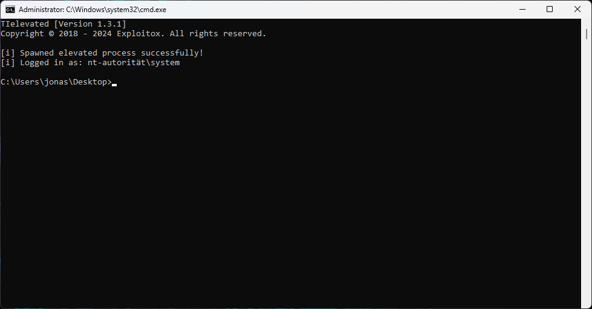

<div align="center">

  <!-- PROJECT LOGO -->
  <br />
    <a href="https://github.com/valnoxy/tielevated">
      
    </a>
  <br />

  [![Version][version-shield]][version-url]
  [![Download Counter][downloads-shield]][downloads-url]
  [![License][license-shield]][license-url]
</div>

[version-shield]: https://img.shields.io/github/v/release/valnoxy/TIelevated?color=9565F6
[version-url]: https://github.com/valnoxy/TIelevated/releases

[downloads-shield]: https://img.shields.io/github/downloads/valnoxy/TIelevated/total.svg?color=431D93
[downloads-url]: https://github.com/valnoxy/TIelevated/releases

[license-shield]: https://img.shields.io/github/license/valnoxy/TIelevated?color=9565F6
[license-url]: https://img.shields.io/github/license/valnoxy/TIelevated

<div align="center">
  <h3 align="center">TIelevated</h3>
  <p align="center">
    <p>Run any process as TrustedInstaller!</p>
    <a href="https://github.com/valnoxy/TIelevated/issues">Report Bug</a>
    ·
    <a href="https://github.com/valnoxy/TIelevated/discussions/">Discussions</a>
    <br />
    <br />
    🎉 Version 1.3.2 is out. Check out the release notes
    <a href="https://github.com/valnoxy/TIelevated/releases">here</a>.
    <br />
    <br />
  </p>
</div>

---

> [!CAUTION]
> With great power comes great responsibility! Think before you type or elevate any process and respect the privacy of others.

# 🚀Introduction
TIelevated is an application that makes it possible to run Windows processes in the context of the built-in user **TrustedInstaller** (NT-AUTHORITY\SYSTEM).  It provides the ability to run processes with the TrustedInstaller user's permissions, which is normally reserved for system files and folders.
This allows system files, for example, to be modified without problems and folders to be accessed that are not even accessible to the administrator.

> [!NOTE]
> TIelevated supports Windows 7 to Windows 11 (including server versions and beta versions). You need at least Administrator permission to run this application. 

# 🤸 Usage
## 💻 1. Elevated Command Prompt
If you run TIelevated without any arguments, an elevated command prompt shell is started.



> [!NOTE]
> Since version 1.3.2, TIelevated includes a UAC bypass. To use it, you must define ```/uac``` as an argument.

## ⚙️ 2. External Programs
You can run external programs via an extended command prompt or simply drag and drop the application onto TIelevated.

# 🧾 License
TIelevated is licensed under [GPL-3.0](https://github.com/valnoxy/TIelevated/blob/main/LICENSE).

<hr>
<h6 align="center">© 2018 - 2025 valnoxy. All Rights Reserved. 
<br>
By Jonas Günner &lt;jonas@exploitox.de&gt;</h6>